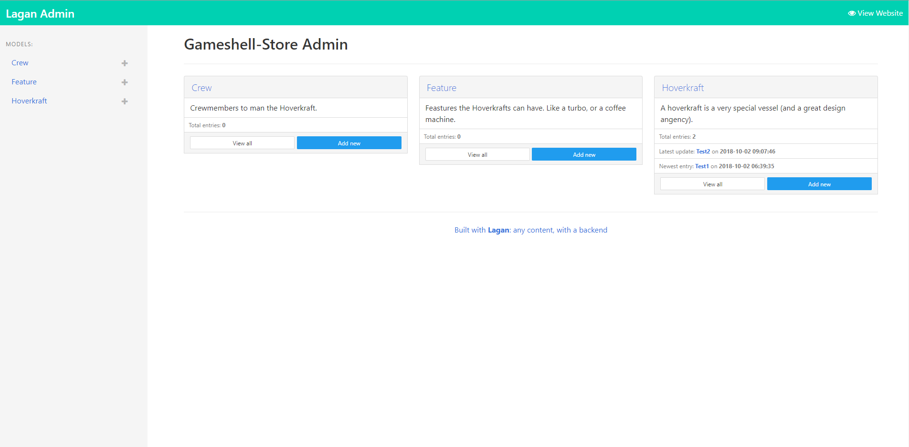
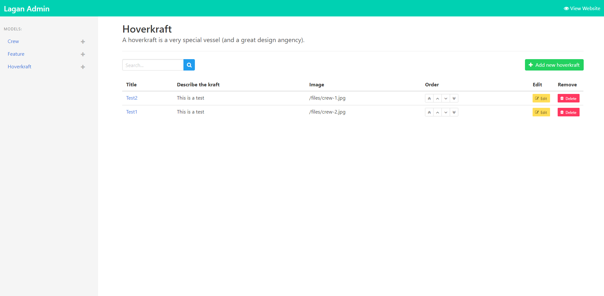
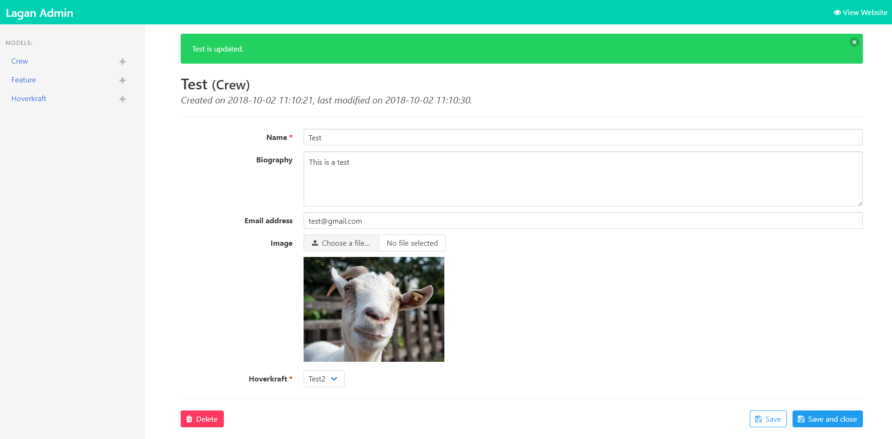

# Lagan - Bulma-Theme for the Admin Panel

This is a simple and beautiful admin theme I made for [Lagan](https://github.com/lutsen/lagan), a different take on a CMS, with a focus on flexibility.  
Made with [Bulma](https://bulma.io).

## Requirements

- Lagan (Version v1.1.2 -> dev-master at the moment)

## How to install

Just drop the ``templates/`` and the ``public/`` folder over your project root.  
This will replace all of the default templates by Lagan.

## Screenshots

---

---

